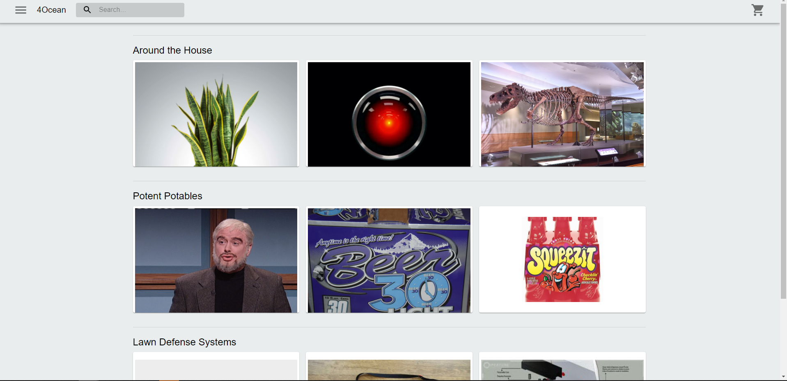
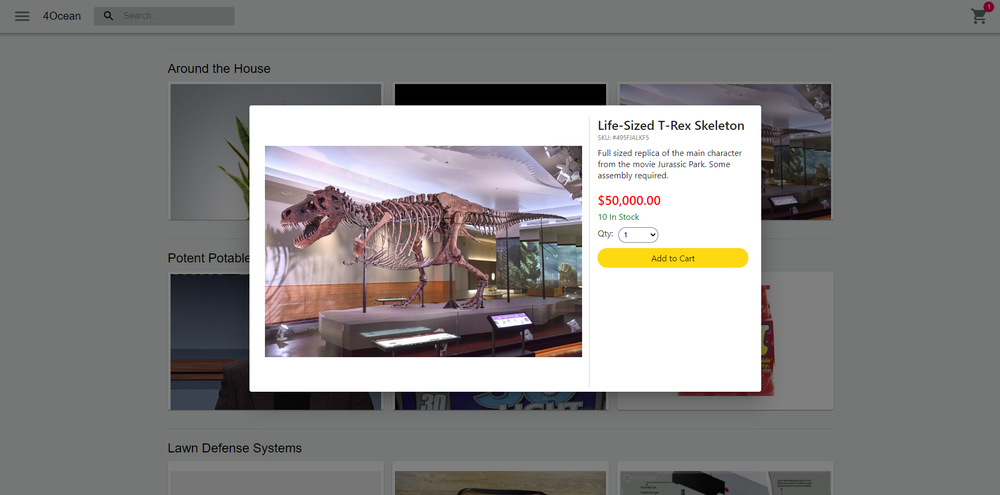
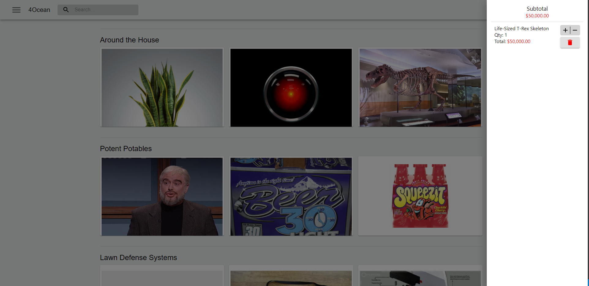

# 4ocean-dev-test
Development test for 4Ocean before the technical interview

# Status

Basic functionality is complete.  There is no routing/navigation in place so the menu links don't go anywhere.  This is okay as the app functions just fine as an SPA.  Images are pulled from various web sources.  In a normal application I would pull these from a CDN.  Application uses Mirage.js to fake an API call for 3 collections and their respective products.  User can add, update, and remove products from their cart based upon a quantity selection.  Search bar is for appearances only.  

There are currently no unit tests in the application.

# Requirements

1. Create a React-based website with two collections (product categories) with 3 products in each collection
	
		Products:
			- Name
			- SKU
			- Description
			- Price
			- Inventory

		Collection
			- Name
			- Products array

2. Add the ability to add a product to a cart. The cart icon should show the number of items that are in the cart.
3. Create mock data that resembles Shopify’s API using a mock API REST instance
4. One of the products should have 0 inventory and disable the ability to add to the cart

# Installation

Installation is just a standard React application.  You will need `node` and `npm` to run the project.  Clone the repository, change your directory to the project folder and then run `npm install` to install the necessary dependencies.  Once complete, `npm start` should begin a local instance of the application at `http://localhost:3000`

# Libraries

React, React-Redux, Typescript, Material-UI, ReduxJS Toolkit, Axios

# Demo Images

